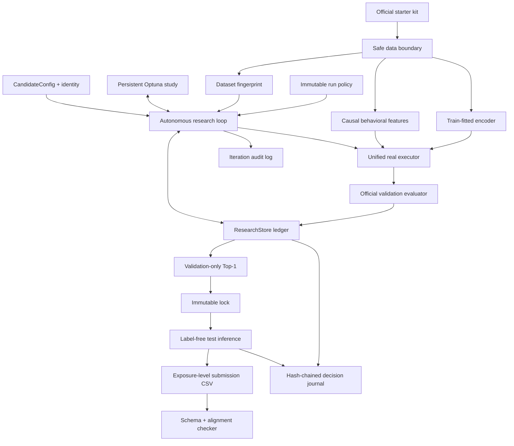
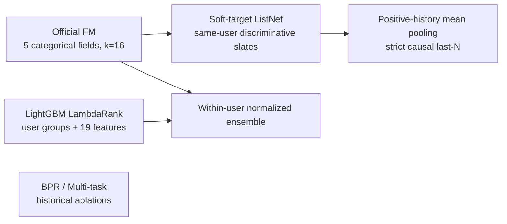
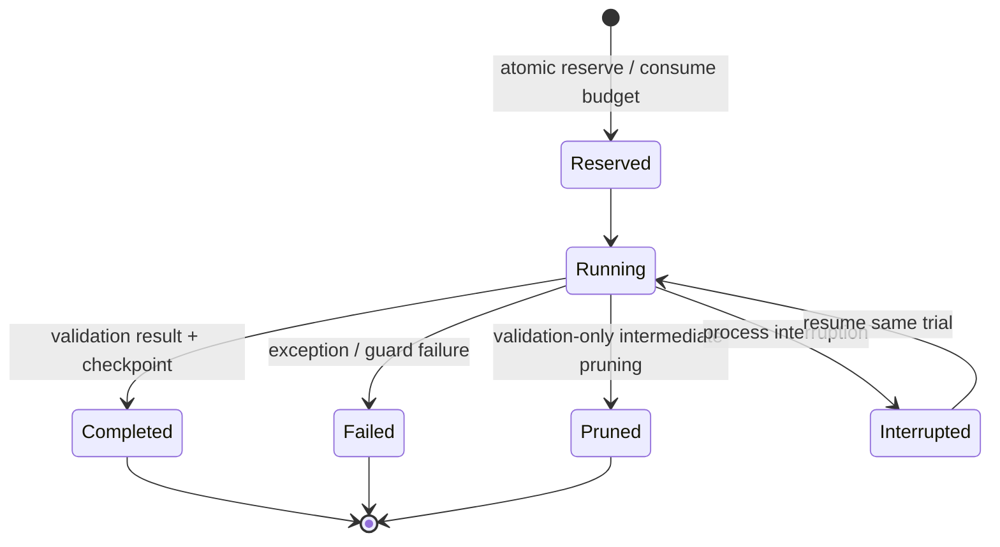

# Agent AI-yoh 完整 Workflow 與設計架構（中文）

English edition: [WORKFLOW_AND_ARCHITECTURE_EN.md](WORKFLOW_AND_ARCHITECTURE_EN.md)

本文件描述 Agent AI-yoh 在 KuaiRand-Pure 上的正式 judged-run：官方約束、資料邊界、
模型候選、自治研究控制面、稽核證據、失敗恢復、validation lock，以及最終
label-free submission。它同時記錄 2026-09-01 已完成 run 的實際結果。

## 1. 目標與不可變條件

任務是在每位使用者既有的 logged exposures 內排序，不做 full-catalog retrieval。

- relevance label：`long_view`
- validation metrics：GAUC、nDCG@5
- primary：`(GAUC + nDCG@5) / 2`
- official baseline hidden primary：`0.5946`
- 固定日期切分：train、validation、test
- train labels 只能訓練；validation 只能評估、early stopping 與選模
- test 只能提供 label-free inference rows；不得取得或使用 test labels/metrics
- Pure 不得使用 random exposure log 或 KuaiRand-1K/27K 的資料、權重、embedding、checkpoint
- 每個 benchmark fingerprint 最多 50 次 training + validation
- failed、pruned、reserved、running、interrupted 都消耗額度
- benchmark run 最長 6 小時，resume 不重置 deadline
- stopping policy 必須在 iteration 1 前固定
- hidden test 只能在 immutable validation lock 後由主辦方評估一次

官方 `data.py`、`baseline.py`、`evaluate.py`、`submit.py` 保持零修改，readiness
check 以 SHA-256 驗證。

## 2. 本次正式結果快照

| 項目 | 結果 |
|---|---|
| Dataset fingerprint | `sha256:73967e0b7ff70aee8d25dc3832bad5de2a7a3cf4a8130f20dcaa93513f92e4f6` |
| Judged ledger | 9/50；因 convergence 終止 |
| Stop reason | `converged_no_0.002_gain_for_3_scored_iterations` |
| Locked trial | trial-07 |
| Model | FM + causal-behavioral LambdaRank ensemble |
| Ranker weight | 0.35 |
| Trees / leaves | 160 / 31 |
| Validation GAUC | 0.6691064835 |
| Validation nDCG@5 | 0.5366193652 |
| Validation primary | 0.6028629243 |
| 相對本次 A-01 FM | +0.0013933778 |
| 顯著性判定 | 小於 epsilon=0.002，不宣稱顯著 |
| Locked checkpoint SHA-256 | `e703d6a26a82b53bb14bf7dca3b8c736de1d6fb8328ff538fe529635286752da` |
| Submission rows | 170,588 |
| Submission SHA-256 | `8237ab9da63215ec68a2801f0aa0aa717a8acab26f7d9dd8012838c8a18b032a` |
| Test labels/metrics used | false / false |

這個 validation 結果不能推導 hidden primary，也不能保證超過 `0.5946`。

## 3. 系統總覽



系統分成兩個平面：

- 資料／模型平面：安全載入、特徵、訓練、validation、checkpoint、inference。
- 研究控制平面：budget、phase、Optuna、候選 identity、決策、停止與稽核。

兩者的交界只有嚴格的 trial contract。研究控制面不能直接讀 test feedback，模型
平面也不能繞過 ledger 開始正式訓練。

## 4. 資料架構與洩漏防護

### 4.1 Safe data boundary

`safe_data.py` 將資料能力拆開：

- train：暴露 features 與 `long_view`，可訓練。
- validation：暴露 features 與 `long_view`，只可交給官方 evaluator。
- test：只建立 `UnlabeledExposure`，包含 row alignment 與 inference 欄位。

Test dates 在讀取 research arrays 時會先被排除，避免程式意外索引
`long_view`。最終 scoring 使用另一條 label-free loader。

### 4.2 Fingerprint

Fingerprint 包含：

- train permitted fields
- public validation label 與 permitted fields
- test inference identity/features，但不含 test feedback columns
- static feature files

Fingerprint 不包含 random exposure log。修改 test labels 不會改變 fingerprint、
research arrays、Top-1 或 submission scores。

每個 fingerprint 擁有獨立的：

- `research.sqlite3`
- `optuna.sqlite3`
- 0/50 budget
- artifacts
- Top-1 與 lock
- audit logs

### 4.3 Causal behavioral features

LambdaRank 使用 19 維 features：

- 5 個官方 categorical fields：user、video、author、tab、duration bucket
- log duration
- hour sin/cos
- days from train start
- video count / smoothed long-view rate
- author count / smoothed long-view rate
- user-video count / smoothed long-view rate
- user-author count / smoothed long-view rate
- user-duration count / smoothed long-view rate

Training row 的 target-derived statistics 只能看 `time_ms` 嚴格更早的 rows；current、
tied timestamp、future rows 全部排除。Validation/test 使用 train 結束時凍結的 aggregates，
不 rolling 納入 validation/test feedback。

## 5. Candidate 與模型架構

### 5.1 Unified CandidateConfig

單一可序列化 config 描述：

- backbone
- Listwise objective
- History residual
- BPR auxiliary objective
- click/play-time auxiliary heads
- LambdaRank parameters
- optimizer、seed、initialization、resource limits

Config validation 拒絕矛盾組合，例如 ranker 與 Listwise/History 同時啟用、standalone
LambdaRank 使用 FM blend、或 disabled module 攜帶 active parameters。

Trial identity 為：

```text
SHA256(dataset fingerprint + canonical config + code version + schema version)
```

JSON key order 不影響 identity；真正影響訓練的 config/code/schema 改變一定產生新 identity。
Exact duplicate 可重用既有 completed result，不重新扣 ledger。

### 5.2 候選模型



Soft-target ListNet 主 loss 使用：

```text
target_distribution = softmax(long_view / target_temperature)
prediction_distribution = softmax(scores / score_temperature)
loss = cross_entropy(target_distribution, prediction_distribution)
```

只使用同一 user 且同時含正負 label 的 discriminative slates。

History 是 last-N positive video embeddings 的 mean pooling，不宣稱為保留順序的 sequence
encoder。Validation history 只來自 train positive rows。

LambdaRank 將 train rows 依 user stable-sort，LightGBM `group` 明確設為每位 user 的
exposure count，直接優化 logged-exposure ranking。

### 5.3 Locked ensemble

FM 與 LambdaRank 分數先在每位 user 內做標準化：

```text
z_user(score) = (score - user_mean) / user_std
```

Locked trial-07 的最終分數是：

```text
score = 0.35 * z_user(LambdaRank) + 0.65 * z_user(FM)
```

Checkpoint 保存 LightGBM model text、best iteration、blend weight、feature schema digest、
dataset fingerprint、seed，以及 FM parameters。

## 6. 自治研究控制面

### 6.1 ResearchStore 是唯一 budget authority

正式 training 前必須原子 reserve。Optuna 只負責 suggestion/history，不能繞過 ledger。

Trial lifecycle：



所有非 duplicate-reuse 的 terminal/non-terminal attempts 都占用一次額度。Resume 使用原
trial id，不重複扣款或重置 optimizer/study/deadline。

### 6.2 Phase policy

通用 phase boundaries：

| Ordinal | Phase |
|---:|---|
| 1–6 | controlled anchors |
| 7–14 | single-module screening |
| 15–34 | conditional TPE search |
| 35–42 | local refinement |
| 43–47 | automatic ablation |
| 48–49 | finalist verification |
| 50 | reserve |

Phase 是上限規劃，不要求用完。Convergence、deadline、fatal guard、budget exhaustion 或
lock 都可以提早停止。

本次 anchors：

1. A-01：official FM reproduction
2. A-02：Soft-target ListNet
3. A-03：causal History prior
4. A-04：causal-behavioral LambdaRank
5. A-05：FM + LambdaRank ensemble
6. A-06：wider-leaf LambdaRank

A-05 是唯一有正向 ranker evidence 的 anchor，因此 trial 7–14 預先改為其局部 grid。
實際在 trial 9 觸發 convergence，trial 10–14 未建立也未扣額度。

### 6.3 Convergence

本次 policy 在 iteration 1 前固定：

```text
epsilon = 0.002
N = 3
minimum_scored_iterations = 9
max_iterations = 50
wall_clock = 6 hours
```

Default cumulative rule：

```text
best(last N scored iterations) - best(all earlier scored iterations) <= epsilon
```

Crash/no-score iteration 消耗 budget/time，但不推進或重置 scored window。

## 7. 端到端 Workflow

### 7.1 環境與 preflight

```bash
.venv/bin/python -m pip install -r tracks/agent_a/requirements.txt
# macOS LightGBM runtime
brew install libomp

tracks/agent_a/check.sh
.venv/bin/python -m tracks.agent_a.judged_cli plan \
  --data-dir KuaiRand-Pure/data \
  --state-root tracks/agent_a/judged_runtime
```

`plan` 必須 read-only，不建立 ledger、不 reserve、不啟動時鐘。

### 7.2 新 fingerprint 初始化

以下只適用全新的 benchmark/fingerprint；不可對本次已完成 Pure run 重跑 `init`：

```bash
.venv/bin/python -m tracks.agent_a.judged_cli init \
  --data-dir KuaiRand-Pure/data \
  --state-root tracks/agent_a/judged_runtime \
  --epsilon 0.002 \
  --convergence-n 3 \
  --minimum-scored-iterations 9
```

Init 凍結 policy、dataset manifest、initial code snapshot、empty 0/50 ledger 與 resource
counters，但不啟動 6 小時時鐘。

### 7.3 Run / inspect / resume

```bash
.venv/bin/python -m tracks.agent_a.judged_cli run \
  --data-dir KuaiRand-Pure/data \
  --state-root tracks/agent_a/judged_runtime \
  --provider-model gpt-5.6-sol

.venv/bin/python -m tracks.agent_a.judged_cli inspect \
  --data-dir KuaiRand-Pure/data \
  --state-root tracks/agent_a/judged_runtime

.venv/bin/python -m tracks.agent_a.judged_cli resume \
  --data-dir KuaiRand-Pure/data \
  --state-root tracks/agent_a/judged_runtime \
  --provider-model gpt-5.6-sol
```

第一個 reserve 啟動 persistent deadline。不要刪除 SQLite、手動改 status 或建立新的 state
root 來重置額度。

### 7.4 Validation lock

Run 停止後，只能鎖定 stable validation Top-1：

```bash
.venv/bin/python -m tracks.agent_a.judged_cli lock \
  --data-dir KuaiRand-Pure/data \
  --state-root tracks/agent_a/judged_runtime
```

Lock 驗證 dataset fingerprint、Top-1、checkpoint digest、production/simulation 身分，並寫出
immutable manifest。Lock 後不得因 test/leaderboard 結果更換模型。

### 7.5 Label-free submission

本次已執行的命令：

```bash
.venv/bin/python -m tracks.agent_a.finalize submission_trial07.csv \
  --data-dir KuaiRand-Pure/data \
  --state-root tracks/agent_a/judged_runtime \
  --split test --judged

.venv/bin/python -m tracks.agent_a.safe_submit_check submission_trial07.csv \
  --data-dir KuaiRand-Pure/data \
  --split test
```

Finalizer 僅重建 test inference features，驗證 lock/checkpoint hash，並透過官方
`submit.write_submission()` 寫出：

```text
row_id,user_id,video_id,score
```

禁止執行：

```bash
python3 submit.py submission_trial07.csv --split test --score
```

真正 hidden primary 只能由主辦方正式評估一次。

## 8. 本次 trial evidence

| Trial | Candidate | GAUC | nDCG@5 | Primary |
|---:|---|---:|---:|---:|
| 01 | Official FM | 0.66713339 | 0.53580570 | 0.60146955 |
| 02 | Soft-target ListNet | 0.66713190 | 0.53581190 | 0.60147190 |
| 03 | Causal History | 0.66718662 | 0.53583813 | 0.60151237 |
| 04 | LambdaRank | 0.66237837 | 0.53349775 | 0.59793806 |
| 05 | FM + LambdaRank, selected blend 0.50 | 0.66889727 | 0.53655154 | 0.60272440 |
| 06 | Wider LambdaRank | 0.66231507 | 0.53374135 | 0.59802821 |
| 07 | Ensemble, blend 0.35 | **0.66910648** | **0.53661937** | **0.60286292** |
| 08 | Ensemble, blend 0.45 | 0.66874242 | 0.53644580 | 0.60259411 |
| 09 | Ensemble, blend 0.55 | 0.66824031 | 0.53644705 | 0.60234368 |

Evidence interpretation：standalone LambdaRank 沒有打敗 FM；它與 FM 有弱互補性，而且較低
ranker weight 較好。整體增益仍低於 epsilon，因此保留為「微幅正向」而非顯著改善。

## 9. 稽核與決策紀錄

每個 iteration 保存：

- hypothesis
- canonical config 與 identity
- exact code diff 與 SHA-256
- lifecycle/recovery events
- validation metrics 或 error
- checkpoint path/hash
- provider/model/raw logs（若使用 code generation）
- runtime、GPU seconds、LLM tokens、manual interventions

所有 Agent 決策透過 `ResearchStore.record_agent_decision()` 進入 append-only SQLite event
stream，再輸出成 SHA-256 hash-chained `agent_decision_journal.json`。每筆包含：

- stage、actor、rationale
- validation-safe evidence
- alternatives 與 selected action
- trial id、data scope、idempotency key
- previous/current decision hashes

本次 final inference decision 記錄 checkpoint 與 submission hashes，data scope 為
`label_free_locked_inference`，沒有 labels 或 metrics。

## 10. 失敗與恢復

| 情境 | 行為 |
|---|---|
| Process interruption | 保留 ledger/study/checkpoint，以 `resume` 延續同 trial |
| Training exception | 標記 failed，保留 error/recovery event，額度不退 |
| Validation-only pruning | 標記 pruned，額度不退，不可成為 Top-1 |
| Duplicate exact config | 重用 completed result，不 reserve 新 ledger trial |
| Provider infrastructure failure | 已 reserve trial 計數，fatal-stop，避免連續浪費 |
| Contract/data guard failure | 保留 failure，fatal-stop，不接受不可信結果 |
| Six-hour deadline | running attempt 保留並停止，不可重置 deadline |
| Convergence | 記錄 stop decision，不可為了剩餘額度繼續 |
| Locked checkpoint mismatch | finalization fail closed，不輸出 submission |

## 11. 主要檔案

```text
tracks/agent_a/
├── candidate.py              # CandidateConfig、validation、canonical identity
├── safe_data.py              # train/valid/test capability boundary
├── fingerprint.py            # content fingerprint 與 code snapshot
├── behavioral_features.py    # strictly-causal 19-feature builder
├── ranker.py                 # LightGBM LambdaRank 與 FM ensemble
├── listwise.py               # Soft-target ListNet
├── history.py                # causal positive-history mean pooling
├── real_executor.py          # unified real training dispatcher
├── autonomous.py             # phases、Optuna、budget-aware loop、stopping
├── codegen.py                # guarded code-generating research candidates
├── store.py                  # SQLite ledger、events、decision journal
├── compliance.py             # immutable policy、clock、audit export
├── judged_cli.py             # plan/init/run/resume/inspect/lock
├── finalize.py               # locked label-free inference
├── safe_submit_check.py      # schema/alignment/finite-score validation
├── readiness_audit.py        # official hashes 與 invariant audit
├── OPERATOR_RUNBOOK.md       # 操作手冊
└── tests/                    # 81 warnings-as-errors tests
```

Runtime evidence 位於 fingerprint namespace：

```text
tracks/agent_a/judged_runtime/<fingerprint>/
├── research.sqlite3
├── optuna.sqlite3
├── run_policy.json
├── run_timing.json
├── dataset_manifest.json
├── initial_code_snapshot.json
├── iteration_audit_log.json
├── agent_decision_journal.json
├── autonomous_report.json
├── top1.json
├── locked_manifest.json
└── artifacts/
```

## 12. 新 dataset / KuaiRand-1K

KuaiRand-1K 必須視為獨立 bonus benchmark：

- 新 content fingerprint
- 新 0/50 ledger、study、Top-1、lock
- 只使用 1K 自己的 train/validation split
- 不載入 Pure checkpoint、embedding 或已訓練權重
- 1K validation 結果不得回頭選擇 Pure 模型
- 先做 schema 與 memory/runtime preflight，再啟動正式 clock

可以轉移的是方法與未訓練 config prior，不是 checkpoint、分數結論或 fingerprint-local
effect claim。

## 13. Final readiness checklist

- [x] 官方四檔 hashes 不變
- [x] Dataset/policy/code snapshot 在 trial 1 前建立
- [x] Ledger 從 0/50 開始且從未重置
- [x] Persistent six-hour clock 正常
- [x] Train-only fitting、validation-only selection
- [x] Test labels/metrics 未使用
- [x] Random log 與 1K/27K 未進入 Pure training
- [x] Failed/pruned/interrupted budget semantics 有測試
- [x] Exact code/config identity 與 duplicate reuse 有測試
- [x] Convergence 在 trial 9 依 frozen policy 停止
- [x] Trial-07 validation Top-1 已 immutable lock
- [x] Checkpoint digest 已驗證
- [x] Submission 170,588 rows、schema/alignment/finite scores 通過
- [x] Final inference decision 與 output digest 已進入 hash chain
- [ ] 主辦方 hidden evaluation 尚未執行

完成 hidden submission 後，只能保存官方結果，不能根據該結果重啟 HPO 或更換 checkpoint。
