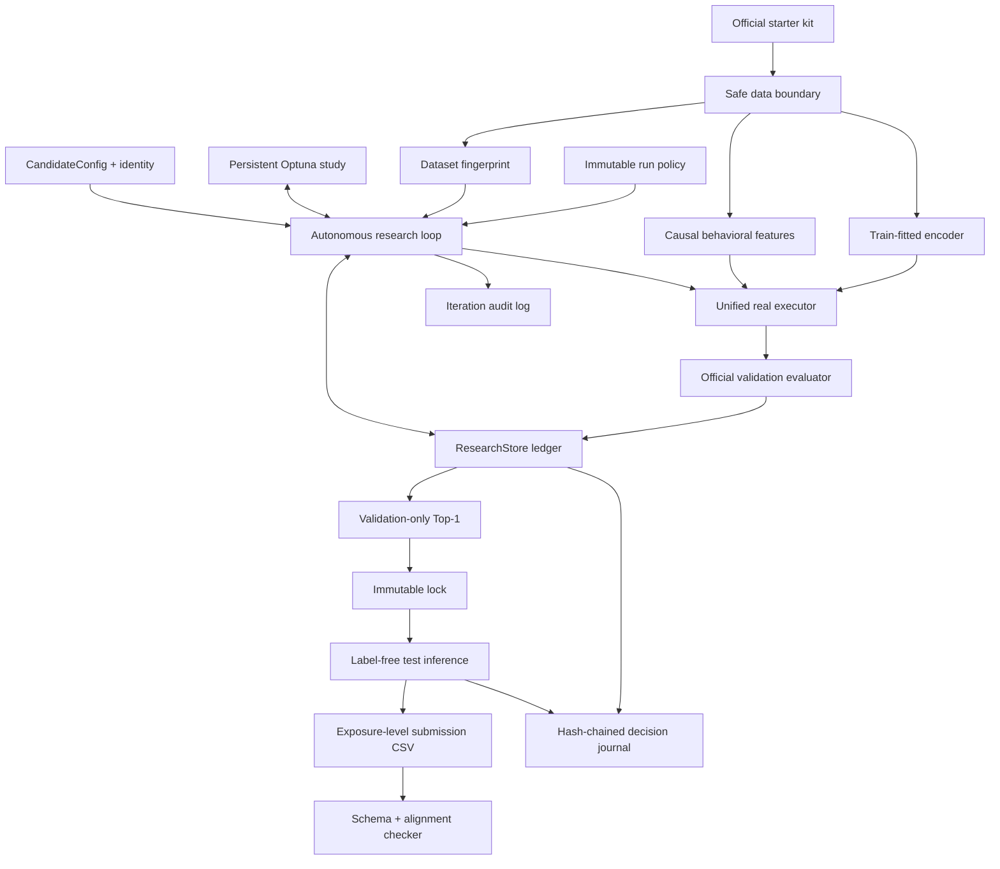
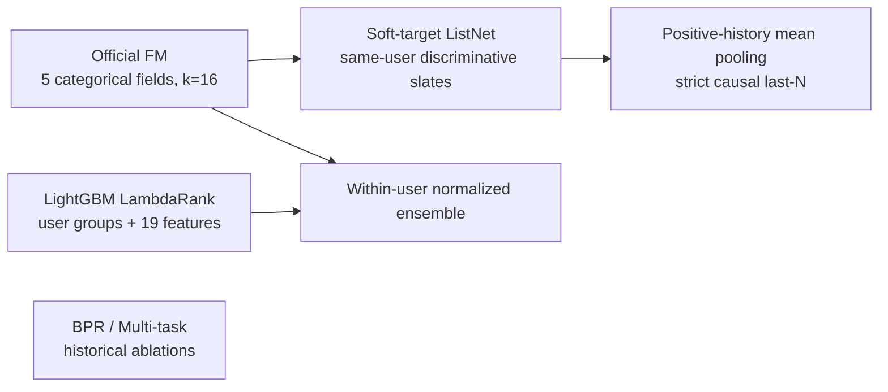
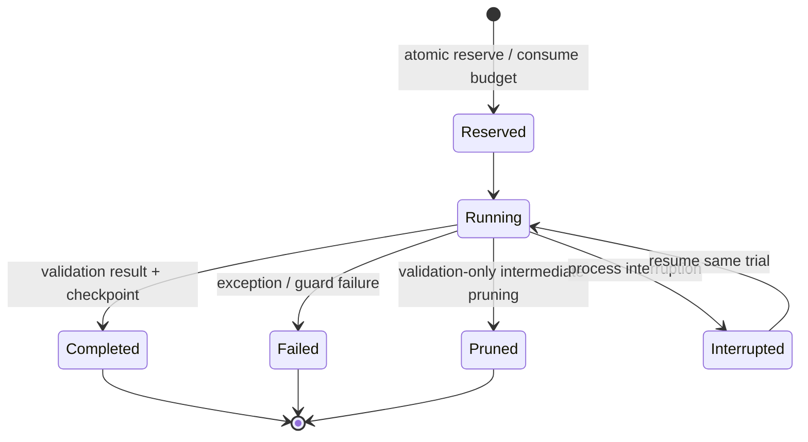

# Agent A Complete Workflow and System Architecture (English)

中文版本：[WORKFLOW_AND_ARCHITECTURE.md](WORKFLOW_AND_ARCHITECTURE.md)

This document describes Agent A's official KuaiRand-Pure judged run: organizer
constraints, data boundaries, candidate models, autonomous research control
plane, audit evidence, failure recovery, validation lock, and final label-free
submission. It also records the actual run completed on 2026-09-01.

## 1. Objective and immutable constraints

The task ranks each user's existing logged exposures. It is not full-catalog
retrieval.

- Relevance label: `long_view`
- Validation metrics: GAUC and nDCG@5
- Primary: `(GAUC + nDCG@5) / 2`
- Official baseline hidden primary: `0.5946`
- Fixed date-based train, validation, and test splits
- Train labels may be used for fitting only
- Validation may be used for evaluation, early stopping, and model selection only
- Test may expose label-free inference rows only; test labels and metrics are forbidden
- Pure may not use the random-exposure log or KuaiRand-1K/27K data, weights,
  embeddings, or checkpoints
- Each benchmark fingerprint permits at most 50 training-plus-validation iterations
- Failed, pruned, reserved, running, and interrupted attempts all consume budget
- Each benchmark run has a persistent six-hour wall-clock ceiling; resume does not reset it
- The stopping policy must be fixed before iteration 1
- Hidden test is evaluated once by the organizer after an immutable validation lock

The official `data.py`, `baseline.py`, `evaluate.py`, and `submit.py` remain
unchanged. The readiness check verifies their SHA-256 digests.

## 2. Final judged-run snapshot

| Item | Result |
|---|---|
| Dataset fingerprint | `sha256:73967e0b7ff70aee8d25dc3832bad5de2a7a3cf4a8130f20dcaa93513f92e4f6` |
| Judged ledger | 9/50; terminated by convergence |
| Stop reason | `converged_no_0.002_gain_for_3_scored_iterations` |
| Locked trial | trial-07 |
| Model | FM + causal-behavioral LambdaRank ensemble |
| Ranker weight | 0.35 |
| Trees / leaves | 160 / 31 |
| Validation GAUC | 0.6691064835 |
| Validation nDCG@5 | 0.5366193652 |
| Validation primary | 0.6028629243 |
| Gain over judged A-01 FM | +0.0013933778 |
| Significance interpretation | Below epsilon=0.002; not claimed as significant |
| Locked checkpoint SHA-256 | `e703d6a26a82b53bb14bf7dca3b8c736de1d6fb8328ff538fe529635286752da` |
| Submission rows | 170,588 |
| Submission SHA-256 | `8237ab9da63215ec68a2801f0aa0aa717a8acab26f7d9dd8012838c8a18b032a` |
| Test labels/metrics used | false / false |

The validation result does not reveal hidden primary and does not guarantee a
score above `0.5946`.

## 3. System overview



The system has two planes:

- Data/model plane: safe loading, feature construction, training, validation,
  checkpoints, and inference.
- Research control plane: budget, phases, Optuna, candidate identity, decisions,
  stopping, and audit evidence.

The planes meet only through a strict trial contract. The research controller
cannot access test feedback, and the model executor cannot begin official
training without an atomic ledger reservation.

## 4. Data architecture and leakage prevention

### 4.1 Safe data boundary

`safe_data.py` separates data capabilities:

- Train exposes features and `long_view` for model fitting.
- Validation exposes features and `long_view` only to the official evaluator.
- Test creates `UnlabeledExposure` objects containing row alignment and
  inference fields only.

Test dates are excluded before research arrays can index `long_view`. Final
scoring uses a separate label-free loader.

### 4.2 Content fingerprint

The judged fingerprint includes:

- Permitted train fields
- Public validation labels and permitted fields
- Test inference identity/features, excluding test feedback columns
- Static feature files

It excludes the random-exposure log. Mutating test labels cannot change the
fingerprint, research arrays, Top-1, or final predictions.

Every fingerprint owns an independent:

- `research.sqlite3`
- `optuna.sqlite3`
- 0/50 budget
- Artifact namespace
- Top-1 and lock
- Audit-log namespace

### 4.3 Causal behavioral features

LambdaRank uses 19 features:

- Five official categorical fields: user, video, author, tab, and duration bucket
- Log duration
- Hour sine/cosine
- Days from train start
- Video count and smoothed long-view rate
- Author count and smoothed long-view rate
- User-video count and smoothed long-view rate
- User-author count and smoothed long-view rate
- User-duration count and smoothed long-view rate

For every training exposure, target-derived statistics use only rows with a
strictly earlier `time_ms`. Current, tied-timestamp, and future rows are
excluded. Validation and test use aggregates frozen at the end of train; they
never roll validation or test feedback into the feature state.

## 5. Candidate and model architecture

### 5.1 Unified CandidateConfig

A single strict, serializable config describes:

- Backbone
- Listwise objective
- History residual
- BPR auxiliary objective
- Click/play-time auxiliary heads
- LambdaRank parameters
- Optimizer, seed, initialization, and resource limits

Validation rejects contradictory combinations, such as enabling a ranker with
Listwise/History, assigning an FM blend to standalone LambdaRank, or attaching
active parameters to a disabled module.

Trial identity is:

```text
SHA256(dataset fingerprint + canonical config + code version + schema version)
```

JSON key order does not change identity. A meaningful config, code, or schema
change does. An exact completed duplicate may be reused without a new budget
reservation.

### 5.2 Candidate families



The Soft-target ListNet objective is:

```text
target_distribution = softmax(long_view / target_temperature)
prediction_distribution = softmax(scores / score_temperature)
loss = cross_entropy(target_distribution, prediction_distribution)
```

Only same-user discriminative slates containing both positive and negative
labels are used.

History is last-N positive-video embedding mean pooling. It is not presented as
an order-preserving sequence encoder. Validation history is constructed only
from train positives.

LambdaRank stable-sorts train exposures by user and passes each user's exposure
count through LightGBM's `group` contract, directly optimizing logged-exposure
ranking.

### 5.3 Locked ensemble

FM and LambdaRank outputs are normalized within each user:

```text
z_user(score) = (score - user_mean) / user_std
```

Locked trial-07 uses:

```text
score = 0.35 * z_user(LambdaRank) + 0.65 * z_user(FM)
```

The checkpoint stores LightGBM model text, best iteration, blend weight,
feature-schema digest, dataset fingerprint, seed, and FM parameters.

## 6. Autonomous research control plane

### 6.1 ResearchStore is the budget authority

Every real training attempt requires an atomic reservation before execution.
Optuna manages suggestions and statistical history, but it cannot bypass the
ledger.



Every non-duplicate-reuse attempt consumes budget, regardless of status. Resume
retains the original trial id, optimizer/study state, budget consumption, and
deadline.

### 6.2 Phase policy

| Ordinal | Phase |
|---:|---|
| 1–6 | Controlled anchors |
| 7–14 | Single-module screening |
| 15–34 | Conditional TPE search |
| 35–42 | Local refinement |
| 43–47 | Automatic ablation |
| 48–49 | Finalist verification |
| 50 | Reserve |

These boundaries are a maximum plan, not a requirement to spend every trial.
Convergence, deadline, fatal guard, budget exhaustion, or a lock may stop the
run earlier.

The controlled anchors were:

1. A-01: official FM reproduction
2. A-02: Soft-target ListNet
3. A-03: causal History prior
4. A-04: causal-behavioral LambdaRank
5. A-05: FM + LambdaRank ensemble
6. A-06: wider-leaf LambdaRank

A-05 was the only ranker anchor with positive evidence. Trials 7–14 were
therefore declared as its local grid. The actual run converged at trial 9, so
trials 10–14 were neither created nor charged.

### 6.3 Convergence

The policy fixed before iteration 1 was:

```text
epsilon = 0.002
N = 3
minimum_scored_iterations = 9
max_iterations = 50
wall_clock = 6 hours
```

The default cumulative rule is:

```text
best(last N scored iterations) - best(all earlier scored iterations) <= epsilon
```

An iteration that crashes without a validation score still consumes budget and
time but neither advances nor resets the scored window.

## 7. End-to-end operating workflow

### 7.1 Environment and read-only preflight

```bash
.venv/bin/python -m pip install -r tracks/agent_a/requirements.txt
# Required by LightGBM on macOS
brew install libomp

tracks/agent_a/check.sh
.venv/bin/python -m tracks.agent_a.judged_cli plan \
  --data-dir KuaiRand-Pure/data \
  --state-root tracks/agent_a/judged_runtime
```

`plan` is read-only. It must not create a ledger, reserve a trial, or start the
clock.

### 7.2 Initialize a new fingerprint

The following is for a new benchmark/fingerprint only. Do not rerun `init` for
the completed Pure judged run:

```bash
.venv/bin/python -m tracks.agent_a.judged_cli init \
  --data-dir KuaiRand-Pure/data \
  --state-root tracks/agent_a/judged_runtime \
  --epsilon 0.002 \
  --convergence-n 3 \
  --minimum-scored-iterations 9
```

Initialization freezes the policy, dataset manifest, initial code snapshot,
empty 0/50 ledger, and resource counters. It does not start the six-hour clock.

### 7.3 Run, inspect, and resume

```bash
.venv/bin/python -m tracks.agent_a.judged_cli run \
  --data-dir KuaiRand-Pure/data \
  --state-root tracks/agent_a/judged_runtime \
  --provider-model gpt-5.6-sol

.venv/bin/python -m tracks.agent_a.judged_cli inspect \
  --data-dir KuaiRand-Pure/data \
  --state-root tracks/agent_a/judged_runtime

.venv/bin/python -m tracks.agent_a.judged_cli resume \
  --data-dir KuaiRand-Pure/data \
  --state-root tracks/agent_a/judged_runtime \
  --provider-model gpt-5.6-sol
```

The first reservation starts the persistent deadline. Never delete SQLite,
manually edit statuses, or choose a fresh state root to regain budget.

### 7.4 Validation lock

After the run stops, only the stable validation Top-1 may be locked:

```bash
.venv/bin/python -m tracks.agent_a.judged_cli lock \
  --data-dir KuaiRand-Pure/data \
  --state-root tracks/agent_a/judged_runtime
```

The lock verifies dataset fingerprint, Top-1 identity, checkpoint digest, and
production/simulation scope. After locking, test or leaderboard feedback may
not change the selected checkpoint.

### 7.5 Label-free submission

Commands executed for this run:

```bash
.venv/bin/python -m tracks.agent_a.finalize submission_trial07.csv \
  --data-dir KuaiRand-Pure/data \
  --state-root tracks/agent_a/judged_runtime \
  --split test --judged

.venv/bin/python -m tracks.agent_a.safe_submit_check submission_trial07.csv \
  --data-dir KuaiRand-Pure/data \
  --split test
```

Finalization reconstructs only permitted test inference features, verifies the
lock and checkpoint hash, and calls the official `submit.write_submission()` to
write:

```text
row_id,user_id,video_id,score
```

This command is forbidden:

```bash
python3 submit.py submission_trial07.csv --split test --score
```

Only the organizer may evaluate hidden primary, once.

## 8. Trial evidence

| Trial | Candidate | GAUC | nDCG@5 | Primary |
|---:|---|---:|---:|---:|
| 01 | Official FM | 0.66713339 | 0.53580570 | 0.60146955 |
| 02 | Soft-target ListNet | 0.66713190 | 0.53581190 | 0.60147190 |
| 03 | Causal History | 0.66718662 | 0.53583813 | 0.60151237 |
| 04 | LambdaRank | 0.66237837 | 0.53349775 | 0.59793806 |
| 05 | FM + LambdaRank, selected blend 0.50 | 0.66889727 | 0.53655154 | 0.60272440 |
| 06 | Wider LambdaRank | 0.66231507 | 0.53374135 | 0.59802821 |
| 07 | Ensemble, blend 0.35 | **0.66910648** | **0.53661937** | **0.60286292** |
| 08 | Ensemble, blend 0.45 | 0.66874242 | 0.53644580 | 0.60259411 |
| 09 | Ensemble, blend 0.55 | 0.66824031 | 0.53644705 | 0.60234368 |

Interpretation: standalone LambdaRank did not beat FM. It provided weak
complementary signal in an FM ensemble, and lower ranker weight was better. The
overall gain remains below epsilon, so it is classified as slightly positive,
not significant.

## 9. Audit and decision evidence

Every iteration records:

- Hypothesis
- Canonical config and identity
- Exact code diff and SHA-256
- Lifecycle and recovery events
- Validation metrics or error
- Checkpoint path and digest
- Provider/model/raw logs when code generation is used
- Runtime, GPU seconds, LLM tokens, and manual interventions

Every Agent decision enters an append-only SQLite event stream through
`ResearchStore.record_agent_decision()` and is exported as the SHA-256
hash-chained `agent_decision_journal.json`. Each decision contains:

- Stage, actor, and rationale
- Validation-safe evidence
- Alternatives and selected action
- Trial id, data scope, and idempotency key
- Previous and current decision hashes

The final inference decision records checkpoint and submission digests with
`label_free_locked_inference` scope and contains no test labels or metrics.

## 10. Failure and recovery behavior

| Condition | Behavior |
|---|---|
| Process interruption | Preserve ledger/study/checkpoint and resume the same trial |
| Training exception | Mark failed, preserve error/recovery event, do not refund budget |
| Validation-only pruning | Mark pruned, do not refund budget, exclude from Top-1 |
| Exact duplicate config | Reuse completed result without a new reservation |
| Provider infrastructure failure | Count the reserved trial and fatal-stop to avoid repeated loss |
| Contract/data guard failure | Preserve failure and fail closed |
| Six-hour deadline | Preserve running attempt and stop; deadline cannot reset |
| Convergence | Record stop decision; remaining nominal budget cannot be used |
| Locked checkpoint mismatch | Finalization fails closed and emits no submission |

## 11. Main files

```text
tracks/agent_a/
├── candidate.py              # CandidateConfig, validation, canonical identity
├── safe_data.py              # train/valid/test capability boundary
├── fingerprint.py            # content fingerprint and code snapshot
├── behavioral_features.py    # strictly causal 19-feature builder
├── ranker.py                 # LightGBM LambdaRank and FM ensemble
├── listwise.py               # Soft-target ListNet
├── history.py                # causal positive-history mean pooling
├── real_executor.py          # unified real-training dispatcher
├── autonomous.py             # phases, Optuna, budget-aware loop, stopping
├── codegen.py                # guarded code-generating research candidates
├── store.py                  # SQLite ledger, events, decision journal
├── compliance.py             # immutable policy, clock, audit export
├── judged_cli.py             # plan/init/run/resume/inspect/lock
├── finalize.py               # locked label-free inference
├── safe_submit_check.py      # schema/alignment/finite-score validation
├── readiness_audit.py        # official hashes and invariant audit
├── OPERATOR_RUNBOOK.md       # operator procedure
└── tests/                    # 81 warnings-as-errors tests
```

Runtime evidence is namespaced under the dataset fingerprint:

```text
tracks/agent_a/judged_runtime/<fingerprint>/
├── research.sqlite3
├── optuna.sqlite3
├── run_policy.json
├── run_timing.json
├── dataset_manifest.json
├── initial_code_snapshot.json
├── iteration_audit_log.json
├── agent_decision_journal.json
├── autonomous_report.json
├── top1.json
├── locked_manifest.json
└── artifacts/
```

## 12. New datasets and KuaiRand-1K

KuaiRand-1K must be treated as an independent bonus benchmark:

- New content fingerprint
- New 0/50 ledger, study, Top-1, and lock
- Its own train and validation split only
- No Pure checkpoint, embedding, or trained weight transfer
- 1K validation results must not select the Pure model
- Schema and memory/runtime preflight before the official clock starts

Methods and untrained config priors may transfer. Checkpoints, fingerprint-local
scores, and effect claims may not.

## 13. Final readiness checklist

- [x] Official file hashes unchanged
- [x] Dataset, policy, and code snapshot created before trial 1
- [x] Ledger began at 0/50 and was never reset
- [x] Persistent six-hour clock operated correctly
- [x] Train-only fitting and validation-only selection
- [x] Test labels and metrics never used
- [x] Random log and 1K/27K excluded from Pure training
- [x] Failed/pruned/interrupted budget semantics tested
- [x] Exact config/code identity and duplicate reuse tested
- [x] Convergence stopped the run at trial 9 under the frozen policy
- [x] Trial-07 validation Top-1 immutably locked
- [x] Checkpoint digest verified
- [x] Submission passed 170,588-row schema, alignment, and finite-score checks
- [x] Final inference decision and output digest entered the hash chain
- [ ] Organizer hidden evaluation not yet executed

After hidden submission, the organizer result may be archived but must never
restart HPO or change the locked checkpoint.
